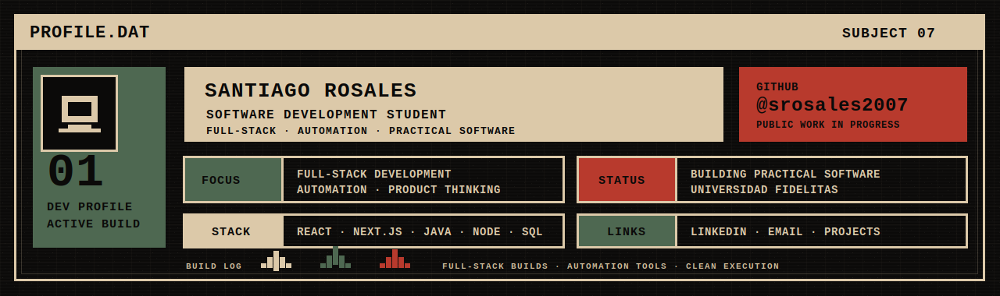

# Santiago Rosales

  <strong>Software Development Student</strong> · Full-Stack Development · Automation · Business-Focused Software

  I build practical software with clean structure, useful UX, and real-world intent.

  <a href="https://www.linkedin.com/in/santiago-rosales-arceyut-08b748346/">LinkedIn</a> ·
  <a href="mailto:sarceyut2007@gmail.com">Email</a>

---

## About Me

I'm a Software Development student at **Universidad Fidélitas** focused on projects where **technical execution** meets **practical value**.

My main areas of interest:
- Full-stack web development
- Automation tools and workflow systems
- Software that helps businesses operate better
- Cleaner architecture, better documentation, and stronger product thinking

What I try to bring into every project:
- Clear structure
- Maintainable code
- Useful interfaces
- Real outcomes over filler features

---

## Current Focus

- Strengthening my skills in **React, Next.js, Java, and backend architecture**
- Turning academic and personal projects into stronger public case studies
- Building a portfolio that reflects growth through real execution

---

## Tech Stack

**Languages**  
Java · JavaScript · TypeScript · Python

**Frontend**  
React · Next.js · Tailwind CSS

**Backend / Data**  
Node.js · Spring Boot · PostgreSQL · MySQL

**Tools**  
Git · GitHub · Figma · VS Code

---

## Selected Work

### Sales & Marketing Optimization System
A business-focused software concept centered on **CRM support, WhatsApp automation, and digital workflow improvement** for small businesses.

**What it demonstrates**
- Problem-solving around real business operations
- Product thinking beyond just code
- Structured planning for useful features and workflows

### Google Maps Lead Extraction Chrome Extension
A browser extension built to extract business lead data from Google Maps, including **name, phone, website, and deeper email discovery workflows**.

**What it demonstrates**
- Browser extension architecture
- DOM interaction and scraping logic
- Practical automation for outreach workflows

### F1Manager
A Java project for **race, team, and driver registration**, built with structured classes, validations, automatic IDs, reports, and `JOptionPane`-based interaction.

**What it demonstrates**
- OOP fundamentals
- Class design and validation logic
- Professional presentation of academic work

---

## What I'm Building Toward

I'm building a profile that reflects:
- Stronger software engineering fundamentals
- Better project presentation
- More polished public repositories
- Clear proof of growth through execution

---

## Contact

- LinkedIn: https://www.linkedin.com/in/santiago-rosales-arceyut-08b748346/
- Email: sarceyut2007@gmail.com

---

> I want my GitHub to show more than activity — I want it to show that I can build, improve, and present my work professionally.

